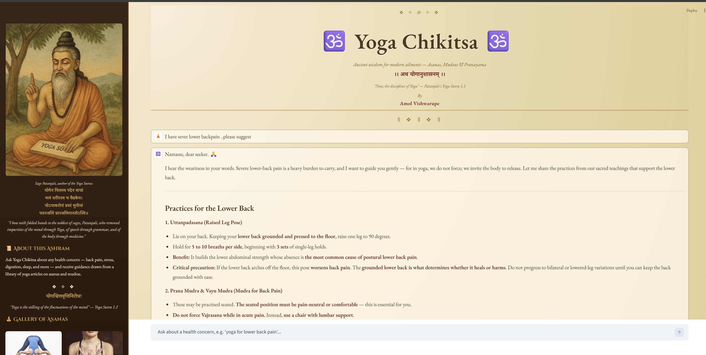
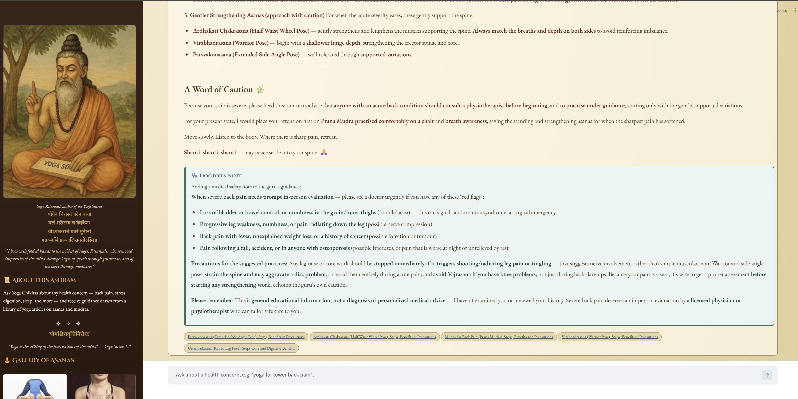

# Yoga Chikitsa

**By Amol Vishwarupe**

An end-to-end pipeline that turns a public yoga article library into an
ancient-themed, multi-agent AI chatbot: a scraper pulls Asanas & Mudras
articles from [habuild.in](https://habuild.in/habitology/asana-mudra/), and a
Streamlit chatbot answers health questions from that library using a
LangGraph multi-agent RAG pipeline built on Claude.

> 🕉️ This is a wellness-education project, not a medical device. Every
> chatbot answer includes a general-physician safety note and a reminder to
> consult a real doctor — see [Disclaimer](#disclaimer).

---

## Screenshots

**The Yoga Guru agent answering a question**, with the ancient-manuscript
header, Sanskrit shlokas from Patanjali's Yoga Sutras, and the sidebar's sage
portrait and asana gallery:



**The Doctor Advisor agent's safety note**, shown distinctly from the guru's
answer, followed by clickable source-article pills linking back to the
original habuild.in articles used to ground the response:



---

## How it fits together

```
┌─────────────┐      586 articles       ┌──────────────────────────────┐
│   scraper/   │ ──────────────────────▶ │  scraper/output/*.json, *.csv │
│ (WP REST API)│                         │       + per-article .txt      │
└─────────────┘                         └───────────────┬────────────────┘
                                                          │ python ingest.py
                                                          ▼
                                          ┌───────────────────────────────┐
                                          │   chatbot/chroma_db/          │
                                          │  (local vector store, chunked │
                                          │   + embedded with MiniLM-L6)  │
                                          └───────────────┬────────────────┘
                                                          │
                          ┌───────────────────────────────┼───────────────────────────────┐
                          ▼                               ▼                               ▼
                  retrieve (Chroma)           yoga_guru agent (Claude)         doctor_advisor agent (Claude)
                  top-k similarity   ───▶   "Yoga Chikitsa" persona   ───▶   "Dr. Ananya" persona adds a
                  search over chunks         answers with asanas/mudras       medical safety note, then
                                              grounded in retrieved text       compose() merges both
                                                                                        │
                                                                                        ▼
                                                                          Streamlit UI (ancient/parchment
                                                                          theme, Sanskrit shlokas, Patanjali
                                                                          & pose imagery from images/)
```

## Repository structure

```
Yoga/
├── scraper/                     # Step 1: pull the source data
│   ├── habitology_scraper.py    # scrapes habuild.in's WordPress REST API
│   ├── requirements.txt
│   ├── README.md
│   └── output/
│       ├── asana_mudra_articles.json   # full structured data, 586 articles
│       ├── asana_mudra_index.csv       # spreadsheet-friendly index
│       └── articles/*.txt              # one plain-text file per article
│
├── chatbot/                     # Step 2: the multi-agent RAG chatbot
│   ├── ingest.py                 # chunks + embeds articles into Chroma
│   ├── rag_graph.py              # LangGraph pipeline (YogaRagPipeline)
│   ├── app.py                    # Streamlit UI
│   ├── assets/style.css          # ancient/parchment theme
│   ├── .streamlit/config.toml    # locks the app to light theme
│   ├── .env.example              # copy to .env and add your API key
│   ├── requirements.txt
│   ├── README.md
│   └── chroma_db/                # generated by ingest.py (git-ignored)
│
├── images/                       # decorative art used by the chatbot UI
│   ├── patanjali.jpg             # sage Patanjali portrait
│   ├── pose1.jpg, pose2.jpg, …   # 7 asana photos for the sidebar gallery
│   └── Screenshot1.jpg, Screenshot2.jpg  # app screenshots (see README above)
│
└── .gitignore
```

## Components

### 1. The scraper (`scraper/`)

Pulls every article in the **Asanas & Mudras** category of habuild.in's
habitology blog by talking directly to the site's WordPress REST API
(`wp.habuild.in/wp-json/wp/v2/posts`) rather than scraping the JS-rendered
HTML listing page — faster, more reliable, and paginated cleanly.

- 586 articles, ~9 MB of structured text
- Outputs: a single JSON file with full metadata + body text, a CSV index,
  and one `.txt` file per article
- See [`scraper/README.md`](scraper/README.md) for usage

### 2. The chatbot (`chatbot/`)

A Streamlit app styled like an ancient manuscript that answers yoga/health
questions using a **multi-agent LangGraph pipeline**:

| Step | What it does |
| --- | --- |
| `retrieve` | Similarity search over the scraped articles, embedded locally with `sentence-transformers/all-MiniLM-L6-v2` (no API key needed) and stored in a persisted Chroma vector store |
| `yoga_guru` agent | Claude, prompted as **Yoga Chikitsa** — an ancient sage in the lineage of Patanjali — answers with asanas, mudras, and pranayama grounded only in the retrieved excerpts |
| `doctor_advisor` agent | Claude, prompted as **Dr. Ananya** — a calm general physician — reviews the guru's guidance and adds a short, distinct note on red-flag symptoms and precautions |
| `compose` | Merges both agents' output into the final answer shown to the user |

The UI is themed with parchment/gold CSS, Sanskrit shlokas from Patanjali's
Yoga Sutras, and imagery from `images/` (the sage Patanjali plus a gallery of
asana photos, sepia-toned to match the manuscript aesthetic).

See [`chatbot/README.md`](chatbot/README.md) for the full architecture notes
and usage.

## Getting started

Each component has its own virtual environment and `requirements.txt`.

```powershell
# 1. Scraper (optional — output/ is already committed, so you only need this
#    to re-scrape or refresh the data)
cd scraper
python -m venv venv
.\venv\Scripts\pip install -r requirements.txt
.\venv\Scripts\python habitology_scraper.py

# 2. Chatbot
cd ..\chatbot
python -m venv venv
.\venv\Scripts\pip install -r requirements.txt
copy .env.example .env
# edit .env and set ANTHROPIC_API_KEY=sk-ant-...

.\venv\Scripts\python ingest.py          # build the vector store (one-time)
.\venv\Scripts\streamlit run app.py      # launch the chatbot
```

## Tech stack

- **Scraping**: Python, `requests`, `beautifulsoup4`
- **Orchestration**: LangGraph (`StateGraph`, multi-agent pipeline)
- **LLM**: Claude (`claude-opus-4-8`) via `langchain-anthropic`
- **Embeddings**: `sentence-transformers/all-MiniLM-L6-v2` via `langchain-huggingface` (local, no API key)
- **Vector store**: ChromaDB, persisted locally
- **UI**: Streamlit, custom CSS theme

## Disclaimer

Yoga Chikitsa provides general wellness information for educational purposes.
It is **not a medical diagnosis** and does not replace professional care.
Every chatbot response includes a doctor-persona safety note, and users are
always advised to consult a qualified physician or certified yoga therapist —
especially for serious, persistent, or worsening conditions, or before
starting a new practice while pregnant, injured, or managing a chronic
illness.

## Author

**Amol Vishwarupe**
